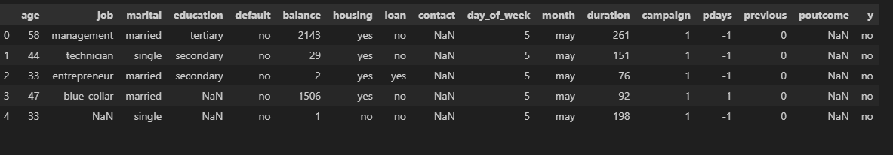
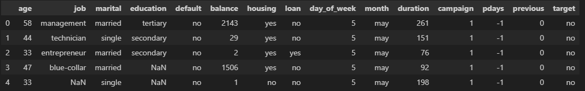
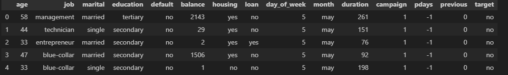
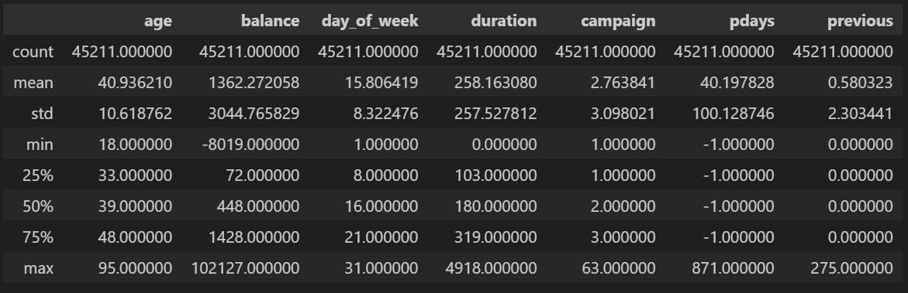

# Exploratory Data Analysis (EDA) on the Bank Marketing Data

***Understanding the Data:***

Based on the provided snippet, it appears to be a portion of a dataset related to a bank's marketing campaign. The columns likely represent various attributes of customers, such as:

* **Demographic:** age, job, marital, education
* **Financial:** default, balance, housing loan
* **Campaign-related:** contact, day_of_week, month, duration, campaign, pdays, previous, poutcome
* **Target variable:** y (likely indicating whether the customer subscribed to a term deposit)

**EDA Steps:**

1. **Data Loading and Cleaning:**

   Load the data into a Pandas DataFrame.

   ```

      from ucimlrepo import fetch_ucirepo 

      # fetch dataset 
      BankMarketing = fetch_ucirepo(id=222) 

      # data (as pandas dataframes) 
      X = BankMarketing.data.features 
      y = BankMarketing.data.targets 

      # metadata 
      # print(BankMarketing.metadata) 

      # variable information 
      # print(BankMarketing.variables) 

      print(type(BankMarketing.data.features))
   ```

   ```

      df = pd.concat([BankMarketing.data.features, BankMarketing.data.targets], axis= 1)
      df.head()
   ```

   

   Handle missing values (NaNs) appropriately. Consider imputation techniques or dropping rows/columns based on the extent of missing data.

   ```
   df = df.drop('contact', axis= 1)
   ```

   ```
     for column in [column for column in df.columns if df[column].isnull().any()]:
         nulls = df[column].isnull().sum()
         non_nulls = (df.shape[0]) - (df[column].isnull().sum())
         print(f'{column} has {nulls} null and {non_nulls} non null values')
   ```

   > *job has 288 null and 44923 non null values
   > education has 1857 null and 43354 non null values
   > contact has 13020 null and 32191 non null values
   > poutcome has 36959 null and 8252 non null values*
   >

   ```
   df.drop(['contact', 'poutcome'], axis= 1, inplace= True)
   df.head()
   ```

   

   ```
   df['job'] = df['job'].fillna(df['job'].mode()[0])
   df['education'] = df['education'].fillna(df['education'].mode()[0])
   ```

   

   Check for data type consistency and convert data types as needed (e.g., 'age' to integer, 'balance' to float).

   2. **Univariate Analysis:**

      * **Summary Statistics:** Calculate descriptive statistics (mean, median, quartiles, standard deviation) for numerical variables like 'age', 'balance', and 'duration'.

        ```
        df.describe()
        ```
        
      * **Data Visualization:**

        * **Histograms:** Visualize the distribution of numerical variables.
        * **Bar Charts:** Plot the frequency of categorical variables like 'job', 'marital', 'education', 'contact', 'day_of_week', and 'month'.
        * **Box Plots:** Identify outliers in numerical variables.
   3. **Bivariate Analysis:**

      * **Correlation Analysis:** Calculate and visualize the correlation between numerical variables using a heatmap or scatter plots.
      * **Grouped Bar Charts:** Compare the distribution of categorical variables across different groups (e.g., 'job' vs. 'y', 'education' vs. 'y').
      * **Box Plots:** Analyze how numerical variables vary across different categories (e.g., 'balance' vs. 'job', 'duration' vs. 'marital').
   4. **Missing Value Analysis:**

      * Visualize missing values using heatmaps or bar charts to identify patterns or relationships with other variables.
      * Consider imputation techniques based on the nature of the missing data and its relationship with other variables.
   5. **Outlier Detection:**

      * Identify outliers using box plots, scatter plots, or statistical methods like the Z-score or IQR.
      * Decide on an appropriate approach to handle outliers (e.g., removal, transformation, or keeping them).
   6. **Feature Engineering:**

      * Create new features based on existing ones (e.g., 'age_group', 'has_loan' [combining 'housing loan' and 'personal loan']).
      * Consider encoding categorical variables using techniques like one-hot encoding or label encoding.

**Visualization Tools:**

* **Matplotlib**
* **Seaborn**
* **Plotly**

**Additional Considerations:**

* **Target Variable Analysis:**
  * Analyze the distribution of the target variable ('y') to understand the class imbalance.
  * Visualize the relationship between the target variable and other key features.
* **Domain Knowledge:**
  * Incorporate domain knowledge to guide the EDA process and interpret findings.
  * Consider the specific context of the bank's marketing campaign to focus on relevant features and relationships.

By performing these EDA steps, you'll gain a deeper understanding of the data, identify potential patterns and relationships, and prepare the data for further analysis, such as building predictive models.
